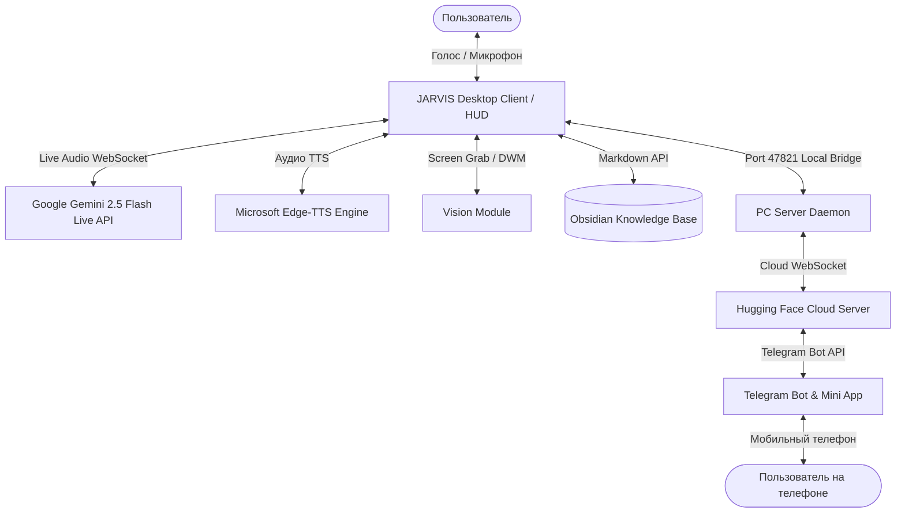

<div align="center">


# 🤖 JARVIS Mark X — Персональный ИИ-ассистент

[](https://www.python.org/)
[](https://riverbankcomputing.com/software/pyqt/)
[](https://aistudio.google.com/)
[](https://github.com/rany2/edge-tts)
[](https://pytest.org/)
[](LICENSE)

**Высокотехнологичный русскоязычный голосовой ИИ-ассистент с нативным двусторонним аудио-потоком, компьютерным зрением, базой знаний Obsidian и управлением компьютером.**

</div>

---

## 📸 Галерея возможностей

<div align="center">

| 🎙️ Нативный аудио-стриминг (Gemini Live) | 👁️ Компьютерное зрение (Vision Mode) |
|:---:|:---:|
|  |  |
| **Мгновенный двусторонний диалог без задержек** | **Анализ кода, экранов и веб-камеры** |

| 🧠 Второй Мозг (Obsidian & SQLite) | 📱 Telegram Bot & Remote PC Control |
|:---:|:---:|
|  |  |
| **Долгосрочная память и база заметок** | **Удаленное управление ПК из любой точки мира** |

</div>

---

## ✨ Ключевые возможности

**35 инструментов.** Каждый объявляет себя сам — список в промпте собирается из
живого реестра, поэтому он не расходится с кодом.

| Категория | Что умеет |
|---|---|
| 🎙️ **Голос и диалог** | Нативный двусторонний аудио-поток через **Gemini Live API**, голос **Fish Audio** или **Edge-TTS**. **Перебивание по имени**: скажите «Джарвис» посреди ответа — он замолчит и переспросит. Режим «зажми и говори», выбор микрофона и динамиков, настройка паузы до конца фразы. |
| 👁️ **Зрение** | Снимок экрана, активного окна и веб-камеры: разбор кода, ревью дизайна, чтение текста с монитора. |
| 🖱️ **Мышь по описанию** | «Нажми Сохранить» — находит элемент по словам и нажимает. **Не нажимает, если не уверен**, что нашёл именно то. |
| 🌐 **Браузер и поиск** | Поиск в сети с ответом голосом (не «открыл вкладку»). Отдельное управляемое окно: нажать кнопку, заполнить поле, прочитать текст со страницы. |
| 📄 **Документы и YouTube** | Перетащите файл в окно и спросите вслух: PDF, Word, Excel, JSON, код, картинки. Пересказ ролика по субтитрам, не открывая его. |
| 📁 **Файлы** | Список, чтение, создание, дописывание, перемещение, поиск по имени и расширению, «что занимает место», раскладка папки по типам. Удаление — в корзину, почти всё отменяется словом «отмени». |
| 🧠 **Память** | Долгосрочная память фактов с панелью в окне: видно накопленное, лишнее убирается крестиком. «Вчера мы говорили о…» в утреннем брифинге. База знаний **Obsidian**. |
| 🔭 **Слежение за темой** | «Следи за выходом прошивки» — проверяет сам и говорит, когда появляется новое. Молчит, пока новостей нет, и ночью. |
| 💬 **Сообщения** | WhatsApp и Telegram: открывает переписку с готовым текстом. **Отправку нажимаете вы.** Записная книжка номеров. |
| 🖥️ **Управление компьютером** | 43 действия: громкость, яркость, скриншот, вкладки, окна, тёмная тема. Запуск программ и **установленных игр** (Steam, Epic). Обои, «сверни всё». |
| 📋 **Буфер обмена** | «Переведи, что я скопировал». Читается **только по просьбе** — за буфером никто не следит. |
| ⏰ **Напоминания и календарь** | Напоминание средствами ОС — сработает, даже если Джарвис закрыт. Календарь, погода, дневной брифинг. |
| 🎬 **Медиа** | Spotify, фильмы, YouTube, таймер сна. |
| 💻 **Код** | Проверка файла Python на ошибки без запуска; запуск скрипта — **после подтверждения кнопкой**. |
| 📱 **Telegram & Mini App** | Удалённый доступ к компьютеру через бота и Web Mini App. |
| 🧩 **Плагины** | Свой инструмент — это один файл в `plugins/`. Ни строчки в `main.py` менять не нужно. |

---

## 🛡️ Чего Джарвис не делает

Это не список недоделок — это принятые решения. Микрофон отдаёт модели всё, что
слышит в комнате, включая звук из телевизора.

- **Не выключает компьютер, не удаляет файлы и не запускает скрипты без
  нажатия кнопки** в окне. Подтверждение выдаёт интерфейс, а не модель:
  повторный вызов инструмента моделью подтверждением не считается.
- **Не отправляет сообщения за вас.** Переписка открывается с готовым текстом,
  отправку нажимаете вы: неотправленное сообщение вы отправите сами за секунду,
  отправленное не тому человеку не отзывается никак.
- **Не нажимает мышью, если не уверен**, что нашёл именно то. Промах — это не
  «не сработало», это нажатая соседняя кнопка.
- **Не следит за буфером обмена** и не показывает панель при каждом
  копировании: это означало бы читать все ваши пароли.
- **Не отчитывается о сделанном, если не сделал.** Отказ планировщика, молчащий
  синтез речи, непрошедшая комбинация клавиш — всё это говорится вслух.
- **Не отменяет догадкой.** Если прежнее состояние восстановить нельзя,
  «отмени» не предлагается вовсе, и об этом сказано сразу.
- **Не обрывается на любой звук.** Перебить его можно, назвав по имени
  («Джарвис») или нажав Escape, — но не репликой из фильма и не разговором
  рядом. В комнате со звуком это выигрыш: замерено, что музыка даёт ту же
  громкость, что живая речь, и различить их порогом нельзя.
- **Не слушает облако, пока говорит.** Микрофон при этом открыт, но кадры
  идут только в локальный детектор имени — наружу не уходит ни одного.
- **Может молчать, пока не позвали.** В настройках разговора включается режим
  «пока не прозвучит „Джарвис“, наружу не уходит ни кадра»: разговор в комнате
  и телевизор не оплачиваются и не покидают машину. Выключено по умолчанию —
  детектор обучен на английском «hey Jarvis», и русское имя узнаёт хуже;
  сначала проверьте по Ctrl+D, что строка «имя слышал» растёт.

---

## 🚀 Установка и Быстрый старт

### Вариант 1. Установка в 1 клик для пользователей (Windows Installer)
1. Скачайте **`JARVIS_Setup_v1.0.exe`** из раздела [Releases](https://github.com/Sardorbek505/jarvis-mark-x/releases).
2. Запустите установщик — он создаст ярлыки на Рабочем столе и в меню «Пуск».
3. При первом запуске откроется **Мастер настройки**:
   - Вставьте бесплатный ключ **Google Gemini API**.
   - Проверьте микрофон встроенным индикатором громкости.
   - Выберите голос и нажмите **«Сохранить и запустить»**.

---

### Вариант 2. Запуск из исходного кода (Для разработчиков)

```bash
# 1. Клонирование репозитория
git clone https://github.com/Sardorbek505/jarvis-mark-x.git
cd jarvis-mark-x

# 2. Установка зависимостей
pip install -r requirements.txt

# 3. Запуск ассистента
python main.py
```

---

## 🔑 Как получить бесплатный API-ключ Gemini (BYOK)

Джарвис работает по модели **BYOK (Bring Your Own Key)** — каждый пользователь использует собственный бесплатный ключ:

1. Перейдите в [Google AI Studio](https://aistudio.google.com/app/apikey).
2. Войдите через ваш Google-аккаунт.
3. Нажмите кнопку **«Create API Key»** и скопируйте созданный ключ вида `AIzaSy...`.
4. Вставьте ключ в окно настроек Джарвиса.

> [!TIP]
> Ключ сохраняется в защищенную пользовательскую директорию `%APPDATA%\JARVIS\api_keys.json` и никогда не передается третьим лицам.

---

## ⌨️ Клавиши

| Клавиша | Что делает |
|---|---|
| **«Джарвис»** посреди ответа | Он замолкает и переспрашивает: «Да, сэр?» |
| **Escape** | Замолчать немедленно и молча |
| **Ctrl+Space** | Зажми и говори (перебивает, если он говорит) |
| **F8** | Позвать из любого приложения или игры |
| **Ctrl+D** | Диагностика: почему он не слышит / не отвечает |
| **Ctrl+M** | Тихий режим |
| **Ctrl+L** | Очистить лог |

---

## 🗣️ Примеры голосовых команд

- **Зрение и мышь**:
  - *«Что сейчас открыто на экране?»*
  - *«Посмотри на код на мониторе и найди ошибку»*
  - *«Нажми кнопку Сохранить»*
- **Документы и ролики** (перетащите файл в окно и спросите):
  - *«О чём этот файл?»* / *«Есть ли тут про сроки?»*
  - *«Что на этой картинке?»*
  - *«Перескажи этот ролик»* (со ссылкой на YouTube)
- **Файлы**:
  - *«Добавь в список покупок молоко»*
  - *«Что занимает место в загрузках?»*
  - *«Разбери рабочий стол»* — и *«отмени»*, если передумали
  - *«Найди все pdf в документах»*
- **Память и разговор**:
  - *«Запомни: я не пью кофе после шести»*
  - *«О чём мы вчера говорили?»*
  - *«Следи за выходом GTA 6 и скажи, когда появится новое»*
- **Связь**:
  - *«Напиши маме в ватсап, что буду через час»*
  - *«Запиши номер Димы: плюс семь…»*
  - *«Скинь этот скриншот мне в телеграм»*
- **Управление ПК**:
  - *«Открой VS Code»* / *«Включи Ведьмака»*
  - *«Сделай звук потише на 20%»* / *«Сверни все окна»*
  - *«Поставь эту картинку на обои»*
  - *«Переведи то, что я скопировал»*
- **Поиск и день**:
  - *«Что нового про запуск?»* / *«Сколько стоит RTX 5080?»*
  - *«Введи в курс дня»*
  - *«Напомни через сорок минут выключить духовку»*

---

## 🏗️ Архитектура системы



---

## 🛠️ Сборка дистрибутива

Для сборки автономного `.exe` и инсталлятора с иконкой Stark Industries:

```bash
# 1. Компиляция автономного бинарника PyInstaller
python scripts/build_exe.py

# 2. Упаковка в ZIP и компиляция Inno Setup Installer
python scripts/package_dist.py
```

Готовые файлы появятся в папке `dist/`:
- `dist/JARVIS_Setup_v1.0.exe` — инсталлятор Windows с встроенной иконкой.
- `dist/JARVIS_Mark_X_Portable_v1.0.zip` — портативная версия.

---

## 🧪 Тестирование и самопроверка

```bash
python -m pytest        # 1048 тестов
python -m ruff check    # линтер
```

Тесты проверяют логику. Но обои, мышь, буфер обмена, планировщик задач, Steam и
живой поиск зависят от конкретной машины, и подменённый системный вызов о них
ничего не скажет. Для этого есть самопроверка:

```bash
python scripts/selfcheck.py            # только чтение, ничего не меняет
python scripts/selfcheck.py --полная   # + обратимые проверки действием
python scripts/selfcheck.py --сеть     # + запросы в интернет (тратит квоту ключа)
```

Она проходит по всем таким местам и отвечает словами: `OK` — работает,
`НЕТ` — нечем работать и чего именно не хватает, `СБОЙ` — всё на месте, но не
работает (вот это и надо чинить).

А когда что-то не так **во время разговора** — **Ctrl+D**. Обе половины
голосового круга отказывают молча: распознавание, которое вас игнорирует, и
синтез без звука снаружи выглядят одинаково. Панель говорит прямо: когда он
слышал вас в последний раз, по какой причине отбрасывает кадры, сколько раз
слышал своё имя и почему не принял обрыв, какая сейчас задержка ответа.
Кнопка «скопировать» отдаёт весь снимок одним куском — чтобы «у меня не
работает» можно было прислать, а не пересказывать.

---

## 📦 Переезд на другую машину

Память, записная книжка, темы слежения, профиль и настройки разговора лежат в
четырёх разных местах и при переустановке системы пропадают молча. Чтобы этого
не случилось:

```bash
python scripts/transfer.py --выгрузить jarvis-backup.zip
python scripts/transfer.py --загрузить jarvis-backup.zip
```

**Ключи API в файл не попадают** — его кладут в облако и забывают в загрузках,
а там лежал бы действующий ключ, по которому выставляют счета. Нужно иначе —
`--с-ключами`. Загрузка по умолчанию ДОПОЛНЯЕТ: то, что вы успели наговорить на
новой машине, останется. `--поверх` заменяет целиком.

---

## 📄 Лицензия

Распространяется под лицензией MIT. Подробности в файле [LICENSE](LICENSE).
